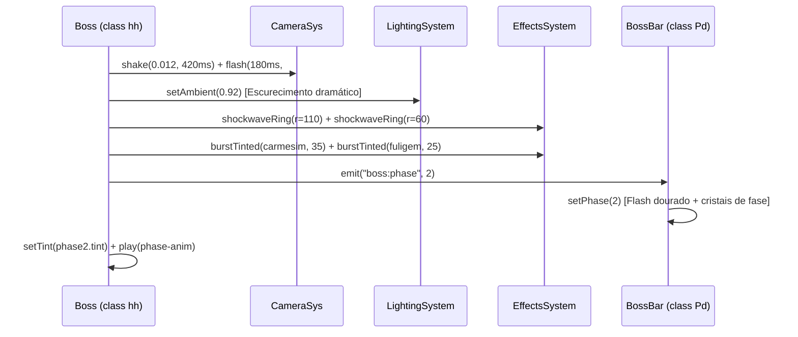

# DepthGate Visual Pipeline: Passo 07 — Enemy, Elite & Boss Visual Overhaul
**Versão**: 2.0.0  
**Arquitetura**: Phaser 4.2.1 / Vite / 2D Canvas & WebGL  
**Direção Visual**: Premium Realistic Dark Fantasy Pixel Art

---

## 1. Visão Geral
Inimigos, Elites e Bosses em DepthGate representam o perigo constante das profundezas. No padrão Dark Fantasy, ameaças não devem ser anunciadas por linhas vetoriais genéricas e caixas vermelhas simplórias estilo arcade. Todo indicador e comportamento visual deve emanar da própria natureza oculta do mundo:
- **Telegraphs Ocultos e Rituais**: Ao invés de um círculo vermelho plano, o solo se racha, runas ancestrais pulsam ao redor do perímetro e uma espiral de aviso converge em direção ao ponto focal.
- **Auras de Afixos para Elites**: Campeões e elites exibem auras atmosféricas que comunicam suas mutações (Vampírico: névoa de sangue carmesim; Blindado: brilho metálico frio; Enfurecido: distorção de calor; Espectral: geada etérea).
- **Transições Cinematográficas de Bosses (Fase 2 / Fase N)**:
  - Escurecimento momentâneo da arena através da iluminação ambiente.
  - Flash de lente em tom púrpura/carmesim escuro na câmera.
  - Ondas de choque duplas com fissuras no solo.
  - Erupção de partículas temáticas e postura agressiva sustentada.

---

## 2. Sistema de Telegraph Dark Fantasy (`class Gh`)

### 2.1. Anatomia do Círculo de Aviso Rúnico (`Gh.circle`)
Quando um boss ou monstro canaliza uma habilidade em área circular:
1. **Perímetro Entalhado (Outer Inscription)**:
   - Traço externo contínuo com atenuação alfa orgânica.
   - 8 marcadores radiais (ticks rúnicos) nos ângulos principais ($0°, 45°, 90°, 135°, \dots$), simulando um diagrama ritual gravado na pedra.
2. **Círculo Interno Concentrico (Occult Ward)**:
   - Linha concêntrica a $70\%$ do raio máximo, fornecendo leitura geométrica de profundidade.
3. **Núcleo de Carga e Pulso de Perigo**:
   - Um preenchimento com expansão radial $r(t) = R \times t$ onde $t \in [0, 1]$.
   - Um anel de traço branco incandescente oscilando na frequência de aviso:
     $$\alpha_{\text{pulse}} = 0.35 + 0.45 \times \sin(t \times 12)$$
4. **Glifo Central**:
   - Cruz ou runa centralizada indicando o epicentro do impacto.

### 2.2. Anatomia do Retângulo Direcional (`Gh.rect` / `Gh.line`)
Para golpes de investida (`CHARGE`), sopro (`FIRE_BREATH`) ou cortes frontais (`SLAM`):
1. **Borda e Cantoneiras Góticas**:
   - Cantoneiras em ângulo reto (serifas) de 6 pixels nos 4 cantos do retângulo, remetendo a limites mágicos delimitados.
2. **Preenchimento Gradual de Condução**:
   - O indicador preenche linearmente na direção do golpe de $-w/2$ até $-w/2 + w \times t$.
3. **Borda Guia Incandescente**:
   - Uma linha vertical frontal em tom brilhante acompanhando a frente de ataque com pulsação senoidal.

---

## 3. Transição de Fases de Bosses (`class hh`)

### 3.1. Sequência Visual de Fase 2
Ao atingir a porcentagem de vida crítica para transição de fase:

### 3.2. Auras e Afixos de Inimigos Elites
Para inimigos com afixos especiais:
- **Vampiric**: Partículas de sangue ascendentes lentas em tons de `#800820` que convergem para o torso ao desferir dano.
- **Molten / Enraged**: Resíduo de faíscas incandescentes nos passos e aumento de escala visual de 15%.
- **Glacial / Chilled**: Pulso de névoa fria esbranquiçada (`#a0d8ef`) diminuindo temporariamente a taxa de quadros de animação do sprite para comunicar congelamento.

---

## 4. Legibilidade e Equilíbrio de Jogabilidade
Embora os efeitos sejam densos e atmosféricos:
- O contraste de cor entre o solo da masmorra e o perímetro do telegraph garante que o jogador sempre distinga claramente a área de perigo em menos de 100ms.
- As cores de aviso respeitam convenções cromáticas Dark Fantasy:
  - Fogo/Impacto Físico: Âmbar e Carmesim (`#ff6a1e` / `#d83018`).
  - Veneno/Necrose: Verde Pútrido e Esmeralda Escuro (`#44aa44` / `#226633`).
  - Magia Arcana/Sombra: Púrpura Profundo e Índigo (`#9040ff` / `#442088`).
  - Gelo/Alma: Azul Glacial e Ciano Pálido (`#70c0ff` / `#d0f0ff`).
