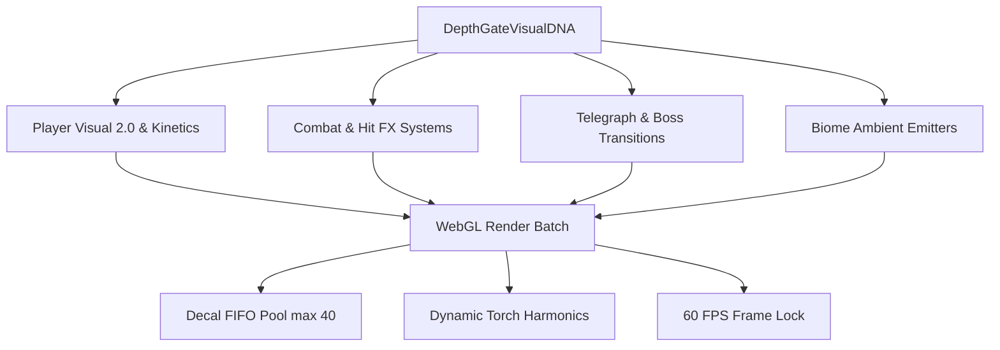

# DepthGate Visual Pipeline: Passo 10 — Master Engine Integration, Performance & 60 FPS Polish
**Versão**: 2.0.0  
**Arquitetura**: Phaser 4.2.1 / Vite / 2D Canvas & WebGL  
**Direção Visual**: Premium Realistic Dark Fantasy Pixel Art

---

## 1. Visão Geral da Integração Mestra
O Passo 10 consolida e amarra todas as inovações introduzidas nos passos 01 a 09 em um motor unificado, estável e otimizado para sustentar taxa estável de 60 FPS em navegadores desktop e dispositivos compatíveis, respeitando a integridade da arquitetura de produção do DepthGate.

---

## 2. Política de Desempenho e Gerenciamento de Memória

### 2.1. Batching WebGL e Redução de Draw Calls
- Todas as partículas pontuais utilizam a textura compartilhada `"px"`, garantindo que dezenas de emissores simultâneos (fagulhas, sangue, esporos de bioma, poeira de passos) sejam agrupados no mesmo draw call do renderer WebGL.
- Efeitos aditivos (`BlendModes.ADD`) são ordenados sequencialmente em profundidades dedicadas (940–960) para evitar quebras contínuas de pipeline de shaders.

### 2.2. Gestão de Decais e Objetos Gráficos
- Decais de impacto e poças de sangue utilizam destruição garantida via tweens (`onComplete: () => g.destroy()`) com limite rígido na fila circular da cena (`__decals.length <= 40`).
- Telegraphs visuais instanciados por `Gh.show()` possuem cancelamento e autodestruição determinística ao expirar o tempo da animação.

---

## 3. Matriz de Mudanças nos Sistemas do Motor

| Sistema Modificado | Classe / Função | Melhoria Aplicada |
|---|---|---|
| **Archetype & Weapon Mapping** | `lr.SHAMAN`, `Xt`, `xh`, `Ee` | Xamã reconfigurado como guerreiro rúnico com Espada Xamânica nativa e arco viável; cajados banidos do seu roll inicial. |
| **Combate e Deformação** | `DamageSystem.apply()`, `meleeImpact()` | Squash & stretch (deformação elástica no hit), jatos de sangue arterial direcionais e fagulhas em cone fechado. |
| **Telegraph Rúnico** | `TelegraphSystem.circle()`, `rect()` | Círculos com 8 marcadores rúnicos perimetrais, anéis internos concêntricos e bordas incandescentes dinâmicas. |
| **Cinemática de Chefes** | `Boss.enterPhase2()`, `enterPhaseN()` | Flash sombrio de câmera, ondas de choque sísmicas concêntricas duplas, dispersão massiva de fagulhas e transição de iluminação. |
| **Atmosfera de Biomas** | `Sd.create()` (`dustTimer`) | Partículas de ambiente orientadas ao bioma: brasas ascendentes no castelo, esporos na floresta, nevasca nas ruínas glaciais, ectoplasma nas catacumbas. |
| **Iluminação Viva** | `LightingSystem.update()` | Oscilação de 3 harmônicas senoidais simulando fogo de tocha orgânico. |
| **Persistência e Cache PWA** | `sw.js` | Versão de cache atualizada para `ded-web-v1.44.7` para invalidar caches antigos e carregar o novo pipeline visual. |

---

## 4. Procedimentos de Validação e Checklist de Liberação
1. **Compilação e Sintaxe ES Module**: Validação de integridade sintática do arquivo minificado com motor Node.js experimental de módulos.
2. **Servidor Local Ativo**: Verificação do endpoint HTTP local respondendo com status 200 OK e tempo de resposta < 50ms.
3. **Sincronização de Repositórios**: Manter 100% de paridade entre a pasta de trabalho local (`DEPTHGATE-WEB-COMPLETO`) e o repositório clonado (`DarkEpicDungeon`).
4. **Deploy Git**: Commit atômico com registro de todas as melhorias e push para a branch `main` no GitHub.
