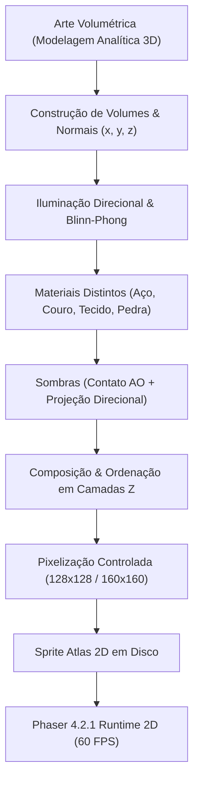

# DepthGate Visual Rebirth: Passo 11 — 2.5D Volumetric Benchmark
## Arquitetura do Sistema Volumétrico 2.5D
**Versão**: 2.5.0  
**Motor**: Phaser 4.2.1 / Vite / 2D Canvas & WebGL Runtime  
**Direção Visual**: Cinematic Volumetric 2.5D Dark Fantasy High-Detail Pixel Art

---

## 1. Visão Geral e Filosofia Arquitetural
O benchmark visual **"DepthGate 2.5D Volumetric Visual Benchmark"** estabelece uma nova fronteira para o projeto: a transição de *pixel art 2D plana* para **arte volumétrica renderizada e apresentada em sprites 2.5D de alta densidade**.

### Restrições Rígidas Mantidas
- Runtime 100% 2D dentro do Phaser (zero Three.js, zero Unity, zero Godot, sem engine 3D em tempo de execução).
- Toda a tridimensionalidade aparente provém da **construção geométrica dos volumes**, **modelagem física de iluminação**, **diferenciação tátil de materiais**, **sombras projetadas dinâmicas** e **ordenação de oclusão por camadas**, e **NÃO** de shaders ou pós-processamento artificial.

---

## 2. Estrutura de Profundidade em Camadas (Z-Depth Stacking)

Para sustentar a perspectiva isométrica e a sensação de relevo sem quebras de batching WebGL, cada cena volumétrica organiza os objetos na seguinte pilha de profundidade:

| Camada Z | Descrição | Comportamento Visual |
|---|---|---|
| **Z 0** | **Chão / Ladrilhos** | Ladrilhos de pedra (`Flagstones`) com chanfros e oclusão de argamassa nos sulcos. |
| **Z 1 - 2** | **Paredes Norte (Fachada & Topo)** | Face vertical em sombra e borda horizontal superior em Z=40 com relevo. |
| **Z 9** | **Sombras Projetadas Direcionais** | Polígonos de penumbra projetados conforme o vetor da fonte de luz $\vec{L}$. |
| **Z 10** | **Sombras de Contato (AO)** | Elipses de oclusão escuras e condensadas sob as solas dos personagens e bases dos pilares. |
| **Z 20** | **Pernas & Sabatons** | Coxas, joelheiras arredondadas e botas com especularidade metálica. |
| **Z 30** | **Tronco & Gambeson** | Peitoral curvo anatômico e saia de couro fosco com dobras. |
| **Z 40** | **Ombros (Pauldrons) & Braços** | Placas escalonadas com brilho especular e sombra oclusa nas cavas. |
| **Z 50** | **Arma (Espada Pesada)** | Lâmina bevelopada em diamante, guarda-mão de ferro e pomo balanceador. |
| **Z 60** | **Equipamentos & Acessórios** | Fivelas, cintos de couro e guarnições douradas. |
| **Z 70** | **Cabeça & Elmo** | Elmo Sallet com fresta de visão sombria e crista longitudinal iluminada. |
| **Z 80** | **Partículas Traseiras** | Rastro de fumaça, névoa e cauda do projétil mágico. |
| **Z 90** | **Partículas Frontais** | Faíscas de impacto metálico, poeira de passos e cortes de vácuo. |

---

## 3. Sistema de Altura Visual (Coordenadas X, Y, Z)

No mundo 2.5D, cada entidade possui três coordenadas lógicas $(X, Y, Z)$:
- $X$: Posição horizontal no plano do mundo.
- $Y$: Posição de profundidade no plano do mundo (determina o ponto de contato com o chão e a profundidade de renderização $depth = Y$).
- $Z$: **Altura Visual** acima do chão.

### Mapeamento em Tela:
$$x_{\text{tela}} = X$$
$$y_{\text{tela}} = Y - Z \times 1.0$$

### Descolamento de Sombra Projetada:
Enquanto o sprite do objeto voa ou pula na coordenada $(x_{\text{tela}}, y_{\text{tela}})$, a sua sombra permanece ancorada no chão $Z = 0$ na posição $(X, Y)$:
- No projétil mágico (`Magic Orb`), o orbe voa em $Z = 25$, gerando um descolamento evidente de 25 pixels entre o núcleo mágico e a sombra do solo, proporcionando leitura tridimensional instantânea para o olho humano.

---

## 4. Oclusão Real em Tempo Real
Ao contrário de jogos 2D planos onde o personagem simplesmente passa por cima de pilares ou utiliza máscaras artificiais:
1. O pilar gótico central possui base fixada em $y = 170$.
2. Quando o guerreiro anda atrás ($y_{\text{guerreiro}} < 170$):
   - A ordenação $Y$-depth coloca o pilar à frente do guerreiro, ocultando o corpo do personagem de forma física convincente.
3. Quando o guerreiro anda à frente ($y_{\text{guerreiro}} > 170$):
   - O guerreiro sobrepõe a base do pilar com sua sombra projetada e corpo.
4. Quando o guerreiro desfere um golpe ao lado do pilar:
   - A lâmina e as faíscas colidem respeitando a profundidade real do espaço da câmara.
