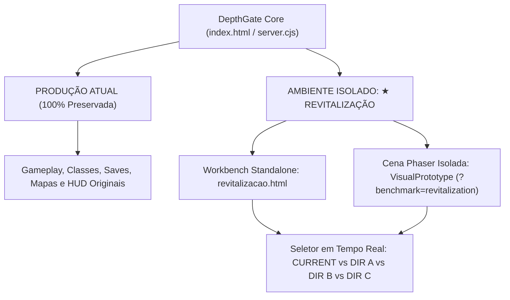

# DepthGate: Art Direction Revitalization — Passo 12
## Arquitetura de Isolamento & Ambiente Experimental de Aprovação
**Versão**: 2.6.0  
**Status da Produção**: 100% PRESERVADO E INTACTO  
**Ambiente**: Laboratório Isolado de Aprovação Artística  

---

## 1. Princípio Absoluto de Isolamento

A experiência de produção do DepthGate (campanha, classes, equipamentos, jogabilidade, saves, menus e gráficos originais) permanece rigorosamente **intocada e inalterada**.

O acesso anteriormente rotulado como `★ 2.5D BENCHMARK` foi formalmente promovido e redesignado para:

```
★ REVITALIZAÇÃO
(ou: ★ DEPTHGATE — REVITALIZAÇÃO)
```

Este ambiente funciona como um **clone experimental estritamente isolado**, destinado com exclusividade à prototipagem artística, teste de resoluções e comparação visual de três novas direções conceituais antes de qualquer decisão de migração definitiva.



---

## 2. Estrutura de Pastas e Separação de Assets

Nenhum asset de produção foi sobrescrito ou alterado. Todos os novos recursos experimentais foram alocados em pastas dedicadas:

```
assets/revitalization/
├── dir_a/                  # DIREÇÃO A: 2.5D Dark Fantasy (160x160)
│   ├── warrior-8dir.png    # Atlas de 8 direções anatômicas
│   ├── warrior-attack.png  # Ciclo cinético de 8 frames
│   ├── enemy.png           # Carniçal das Tumbas (Crypt Revenant)
│   └── pillar.png          # Coluna de granito chanfrado
├── dir_b/                  # DIREÇÃO B: Cinematic Pixel Art (160x160)
│   ├── warrior-8dir.png    # Atlas de 8 direções estilizadas
│   ├── warrior-attack.png  # Ataque com espada rúnica
│   ├── enemy.png           # Demônio de Sangue (Bloodbound Fiend)
│   └── pillar.png          # Coluna com filigrana dourada
├── dir_c/                  # DIREÇÃO C: Volumetric Pixel Art (160x160)
│   ├── warrior-8dir.png    # Atlas pré-renderizado quantizado
│   ├── warrior-attack.png  # Golpe volumétrico com normais contínuas
│   ├── enemy.png           # Gárgula de Obsidiana
│   └── pillar.png          # Coluna de pedra lisa cilíndrica
└── shared/                 # Elementos compartilhados da câmara
    ├── dungeon-tiles.png   # Ladrilhos de pedra em relevo 2.5D
    └── magic-orb.png       # Projétil com altura Z=25
```

---

## 3. Modos de Acesso ao Ambiente de Aprovação

Para conveniência de inspeção pelo responsável técnico e artístico:

1. **Atalho Superior na Interface Web**:
   - Botão flutuante `★ REVITALIZAÇÃO` no canto superior direito de [index.html](file:///c:/Users/rafaelscarpille/Downloads/DEPTHGATE-WEB-COMPLETO%2004-10-2026/DEPTHGATE-WEB-COMPLETO/index.html) apontando diretamente para o laboratório de comparação interativo.
2. **Menu Principal do Jogo (In-Game)**:
   - Botão `★ REVITALIZAÇÃO` integrado à lista de menus da cena `MainMenu`, permitindo navegar para a cena de teste e retornar à produção a qualquer instante pressionando `ESC`.
3. **Página de Laboratório Dedicada**:
   - [revitalizacao.html](file:///c:/Users/rafaelscarpille/Downloads/DEPTHGATE-WEB-COMPLETO%2004-10-2026/DEPTHGATE-WEB-COMPLETO/revitalizacao.html) — interface completa com troca dinâmica de estilos em tempo real (`CURRENT`, `DIR A`, `DIR B`, `DIR C`), controle de 8 direções, iluminação orbital, simulação de ataque e rubrica de avaliação integrada.
